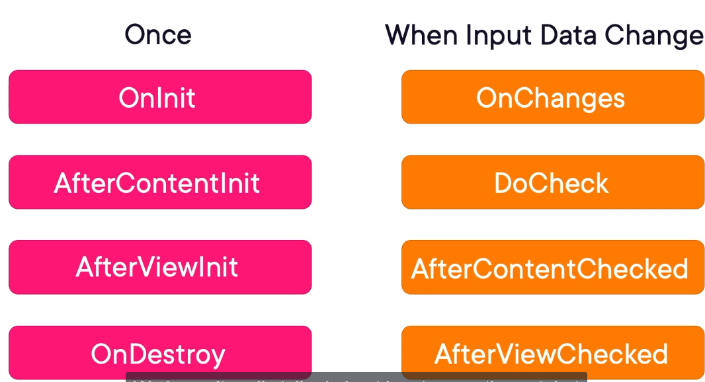
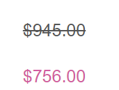
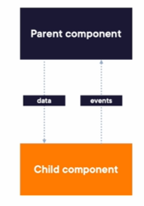
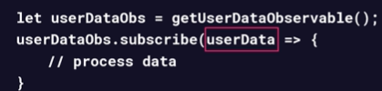

# JoesRobotShop

The node.js version used in this repo is 18.10.0. Use the following commands to setup node for this project

```
nvm install 18.10.0
nvm use 18.10.0

```

This project was generated with [Angular CLI](https://github.com/angular/angular-cli) version 16.0.0 with the command ng new joes-robot-shop.
Javascript needs a javascript engine in order to run. Most browsers come with one. For development, in a developer machine, we need to install node.js. Node is the engine to run javascript on local machines.

## Creating components

As a recap, the base unit of angular are the so called components: they allow to define the HTML, CSS and javascript for a page. They can be a page or part of a page.

We can create a component by using the Angular CLI command:

```
ng generate component <componentName>
```

Inspecting the component typescript file, we observe 3 main sections:

1. Imports from angular
1. Component decorator: decorators are a javascript concept that allows adding metadata to a class or other type of object. We have the file for the template, an array of styles (we can add multiple styles for the same component). If we have very very small components, we could define the template and styles inline and delete the corresponding files.
   The selectors defines the html tage name that you can use to display this component inside the other components.
   The selector's prefix is app by default. so the generated component selector was 'app-home'. The prefix can be changed in the angular.json file.
1. TypeScript class: where we add properties, functionality and business logic to the component.

The CLI did more for us: it generated the files following the best practices. All components need to be imported into a module, and the CLI imported it to the app module.

Each component has its own style but we can define styles globaly in the application in the styles.css files.
We need to add images to our bot component: there is a standard place to put static resources like images and this place is _assets_ folder.
Check how we reference images in the HMTL and CSS:

```
    <div class="promoted">
      
      <div class="promo-text">
        <div class="promo-main-text">DISPELL THE ROBOT APOCALYPSE MYTH</div>
        <div class="promo-sub-text cta">
          <div>SAVE 20% ON OUR FRIENDLIEST</div>
          <div>ROBOT HEADS</div>
        </div>
      </div>
      
    </div>
```

```
  .hero {
    background-image: url("assets/images/hero-banner.png");
    background-repeat: no-repeat;
    height: 300px;
    background-size: cover;
    background-position: center center;
    text-align: center;
    margin-left: -8px;
    margin-right: -8px;
  }
```

It is worth mentioning that the assets can be referenced like this because the Angular CLI referenced them in tha angular.json file on the array assets. So if we want to add more assets folder we need to add it to angular.json.

Every component in angular has a lifecycle, that is defined by a series of events that occur throughout the life of the component. When an even occurs you can execute code using lifecycle hooks.
Some occur only once, some multiple times:


Some of the hooks are more used than others. The hooks that are used the most are:

1. OnChanges - execute code when data changes.
1. OnInit - typically to fetch data.
1. OnDestroy - used for cleanup to avoid memory leaks.

We implement the hook on the component class by adding the 3 pieces:

1. Import the hook
1. Implement the interface
1. Add the method (do not forget to add the prefix ng).

## Template syntax and binding

Interpolation is the process of putting expressions into our HTML that angular will evaluate and convert into HTML when it is rendered. Example:

```
<h1> 2 + 2 = {{2+2}} </h1>
```

Angular will render this as 2 + 2 = 4
We have some limitations though like: {{Math.Round(2+2)}}. This wont compile.Angular does it on purpose to limit the javascript expressions in HTML, The code should reside mostly in the component class. The curly braces is basic interpolation that we will use to bind data to HTML.
Like we do here:

```
<div class="description">{{product.description}}</div>
```

When the property changes the UI gets updated.

Check here what to do in the case of an image path generated dynamically:

```

```

So far we've seen interpolation for binding. Let's see attribute binding
[alt]="product.name"
when wrapping the html attribute in square brackets, we can use the javascript expression directly.
Lets see the image example with attribute binding:
[src]="'assets/images/robot-parts/'+ product.imageName"
Important to not that the square brackets generate a one way binding from the component to the template. So if the user types in a text box, that would not change the data in the component.
To cleanup HTML we can use functions:
[src]="getImageUrl(product)"
See in the component class.

```
 getImageUrl(product: IProduct){
  return '/assets/images/robot-parts/' + product.imageName;
 }
```

Lets now use the _ngFor directive to render a list of products. The _ means that this directives add or remove html on a page.
Lets change the <li> html element to render a list of products (this list in production would come from an API).

```
    <ul class="products">
      <li class="product-item" *ngFor="let product of products">
        <div class="product">
          <div class="product-details">
            
            <div class="product-info">
              <div class="name">{{product.name}}</div>
              <div class="description">{{product.description}}</div>
              <div class="category">Part Type: {{product.category}}</div>
            </div>
          </div>
          <div class="price">
            <div>${{product.price.toFixed(2)}}</div>
            <button class="cta">Buy</button>
          </div>
        </div>
      </li>
    </ul>
```

The product list gets generated. Cool!!!

What about bindings the other way around?
Lets see the on click event:

Notice we use normal brackets. Normal brackets mean the direction is going from the template to the component, so the opposite direction of the square brackets.
See <a class="button" (click)="filter='Bases'">Bases</a>. We set a filter variable in our component and we add a new method to filter the list of products based on that filter:

  <li class="product-item" *ngFor="let product of getFilteredProducts()">

What about numm objects? Angular provide the _safe navigation operator_ to prevent errors while rendering the page, _?_:

<div class="name">{{product?.name}}</div>

What about showing conditional elements in the page? We use the \*ngIf directive. This example will show the discounted price, if an item has discount or the full price if the item does have discount:

```
          <div class="price">
            <div *ngIf="product.discount===0">${{product.price.toFixed(2)}}</div>
          <div class="discount" *ngIf="product.discount>0">
            ${{ (product.price * (1 - product.discount)).toFixed(2) }}
```

*ngSwitch is also a directive similar to *ngIf . We can also hide content with [Hidden] attributes but it is rare.
It should only be used when the content is very complex and we should avoid rendering multiple times.

Pipes can be used to format data like currency, dates, percentages, etc..
Lets see an example of formatting a price:

```
{{ (product.price * (1 - product.discount)) | currency }}
```

## Styling Angular Components

_styles.css_ is created by default and it is the main CSS file for the entire application. It is where we put in all the styles for our application.
Example of using 2 html classes in one control: <a class="button bold">

Angular gives an option of CSS encapsulation (thos does not come natively with css).
It handles some of the problems CSS has in general, when developers apply style to broadly or problems with styles that exist that we dont know if they are used anymore or not.
Lets see, if we go the catalog component and apply thos style to the anchor elements:

```
a {
 font-weight: bold;
}
```

This anchor style will be applied to all the anchor elements of the individual component. Not to the whole application. This is CSS encapsulation at component level.

We can include styles directly on the component class and not use a separate file for the component, but people do that almost never.

Now lets imagine we want to strike through the price of items that have discount greater than 0. We want to show the full price with a dash and the discounted price, like this:



There are several ways to do it. First, we have a class in css like this:

```
.strikeThrough
{
  text-decoration: line-through;
  font-size: 18;
}
```

Then we can use a directive similar like we have seen before:

```
<div [class.strikeThrough] ="product.discount >0">{{product.price | currency}}</div>
```

Here the class applied to this div element is the strithrough if the discount is greater than zero. This is called class binding.
This can get a little bit wordy if we have lots of classes.
An alternative is to use the ngClass binding.
This way I can give it multiple classes, each with a unique boolean condition that can apply to this:

```
<div [ngClass] ="{strikethrough: product.discount >0}">{{product.price | currency}}</div>
```

We can actually also use a function:

```
<div [ngClass] ="getDiscountedClasses(product)">{{product.price | currency}}</div>
```

We would write the function in the component like this:

```
 getDiscountedClasses(product: IProduct){
  return  {strikeThrough: product.discount >0}
 }
```

Or we could just return the string of the class as well: return 'strikeThrough'
Or multiple classes like : return 'strikeThrough bold', to apply multiple css classes. We can also just return array, so it is easier to add more classes.
It is also possible to use _class and ngClass_ together.
There is an analogous sort of feature for styles: ngStyle directive:
[ngStyle]="{color : product.discount > 0? 'green' : ''}"
Like the ngClass we could also transform this into a function.

There CSS frameworks like Saas, bootstrap and Tailwind. Saas is a flag we can setup when starting a new angular project. Cool feature like nested CSS, etc. Out of scope of this training.

## Communication between components

Components can contain other components. Communication between components becomes a need, specially when they share same pieces of data.
This communication is accomplished through a pattern called _one-way dataflow_
In _one-way dataflow_, the parent component contains the data, and it sends that data down to the child component. Example: a parent component might contain a list of costumers and a child component might display a single costumer.
Then, for example, when we want to deactivate a costumer that is not done directly from the child component. Instead, the child component communicates the event back to its parent component, that would then execute the action that changes state.
_one-way dataflow_: data goes down, events go up:


Coming to our example, on the catalog component lets extract the code inside the ng for list with a new product-details component.
It is in the html file that we push down the data, by using binding:

```
      <li class="product-item" *ngFor="let product of getFilteredProducts()">
       <bot-product-details [product] = "product"></bot-product-details>
      </li>
```

As we can see, we have a new product details component that has a product attribute. It needs an input decorator on this attribute. Inputs in angular is a way to communicate from parent to child to push the data down:

```
export class ProductDetailsComponent {
@Input() product! : IProduct; // input decorator directive
}
```

Now lets see how the communication between child component and parent component happens. By refactoring the catalog component, we introduced a problem. The add to cart method on the product details component is not adding any items to the cart, because the cart belongs to the catalog component, which makes sense!

We want to send an event to the catalog component, when the user presses the buy button on the product-details component and have the actual catalog component to do the job of adding the product to the cart.
The first step to do that is to use an Output decorator and declare an event emitter:

```
export class ProductDetailsComponent {
@Input() product! : IProduct;
@Output() buy = new EventEmitter(); // the EventEmitter type from angular
}
```

With those lines of code we create an event, and when the user clicks the buy button, the event is emitted:

```
 buyButtonClicked(product: IProduct){
  this.buy.emit();
}
```

We can send data in the emit method, but we do not needed because in the parent component, we have access to the product object through the ngFor directive:

```
    <ul class="products">
      <li class="product-item" *ngFor="let product of getFilteredProducts()">
       <bot-product-details [product] = "product" (buy)="addToCart(product)"></bot-product-details>
      </li>
    </ul>
```

The previous code is from the catalog component, the parent component. We handle the event like we handle all other events, like button clicks. The catalog takes care of adding the item to the cart.
This refactoring made the catalog component HTML way smaller. In production apps, child components improve radability by a lot.

## Creating Services

Services is where the business logic goes. Examples: calculate tax rate service, etc..
It is where the code that can be reused can go.
Services are made available to the components in 2 ways: dependency injection or injection functions.

Lets refactor one mora time the catalog component and remove the responsibility of managing the cart to a _cartService_:

```
import { Injectable } from '@angular/core';

@Injectable({
  providedIn: 'root'
})
// service is just a class
export class CartService {

  constructor() { }
}

```

We can see that a service is basically a class. In order to be used within angular ecosystem it needs the _Injectable_ decorator. It was the word the angular team chose to mark classes as services.
The _providedIn: root_ basically tells angular that this service belongs anywhere in the angular application. Let's refactor the catalog!
The cart arrays is moved to the service. But how do we use the service in the component? We need to tell Angular that the catalog component needs an instance of the CartService. Angular will inject the cart service in the component.
To note: services in angular are singletons by default. It is what we need most of the time because we are managing state. So in the catalog component, we inject the service in the constructor:

```
 constructor(private cartService : CartService) {}
```

There is another way to do inject the cart service using the inject function, instead of performing constructor injection:

```
 private carSvc: CartService = inject(CartService) // the service type;
```

Constructor syntax is prefered because of tests.
Our example is very simple. But in real world apps with lots of logic, services are a powerful way of encapsulating business logic that can be reused. COmponents become responsible only for display logic. State management stays in services.

## Fetching and Manipulating data

In production apps, data is in a remote database, in a server somewhere. We fetch the data from the server and we update the data in the server. For that, we need to make http calls.

### Observables

Before digging deep, it is important to understand the concept of observables: a way to deal with asynchronous data.
Back in the old days, we would request something from a server and the response would be fetched in a callback method. This has problems.
Then we had _Promises_ and finally obsevables.
Observables are powerful because they can handle streams of data.
This is the observable design pattern shining.
We subscribe to the observable with a callback function that receives the data that is comm=ing through the observables:


We get the observable from Angular itself.
Similar to .net, instead of the next callback we can also provide callbacks for erros and oncomplete (see observable pattern).

Sometimes we want to modify the data coming from the server before hitting the observable. We can do that with _pipe_ functions.
They allow us to process data so we can reuse this in all places in code that we subscribe to the observable.
Summarizing:

